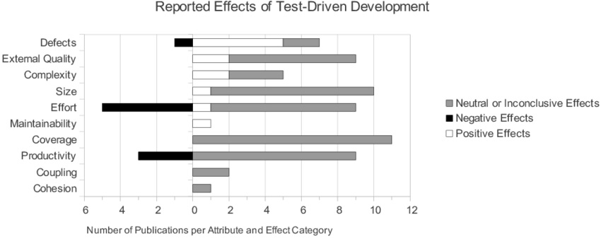
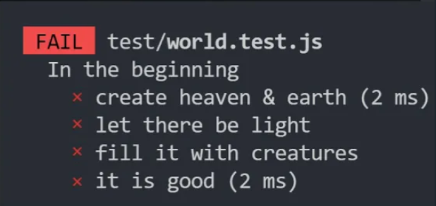
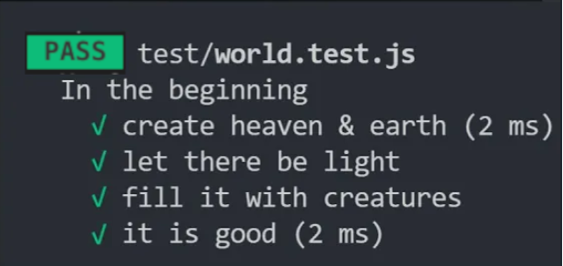
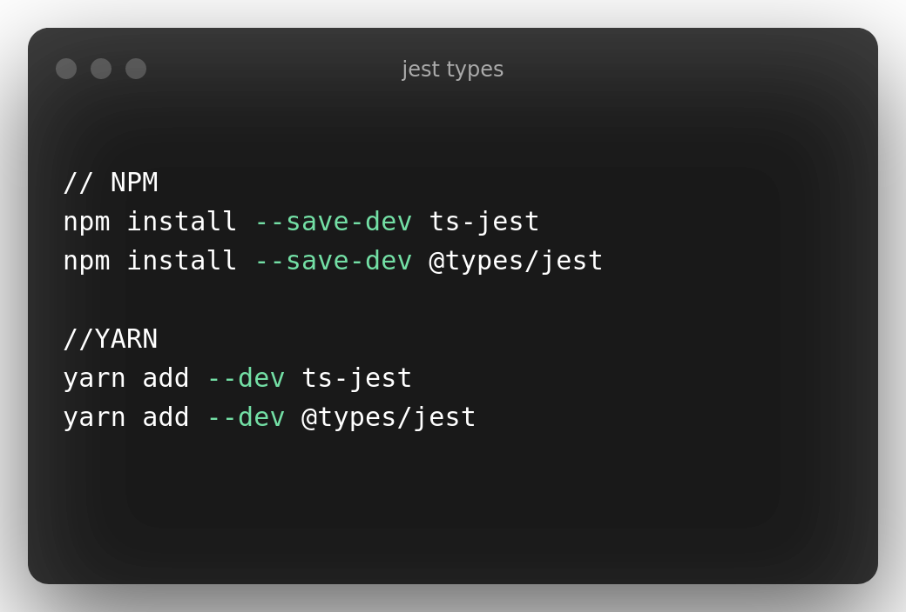
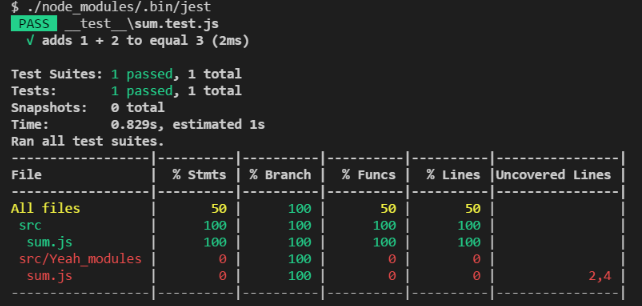

# Test-Driven Development
### A Time-Tested Recipe for Quality Software

#### ✍️ Djon & Schuh

## 🗺️ Overview

- Definition
- History
- Meta Study
- 3 Steps of TDD
- Benefits
- Different Styles
- Why we chose Jest
- Coding Example
- Jest vs Mocha

## Definition

TDD ist eine Design Praxis in der Softwareentwicklung, bei der die Struktur/Funktionalität des Programms im Vorfeld durch UNIT Tests definiert wird.

Die aus dieser Herangehenweise resultierenden Effekte werden weitgehend von Entwicklern geschätzt.

Die meisten Entwickler implementieren ihre Software völlig ohne Tests, oder bis sie ein funktionierendes Feature haben.

Vorallem bei der Front-End Entwicklung wird dies oft außer Acht gelassen. Dabei ist das Testen von Software äußerst nützlich. Wir zeigen euch heute, wie einfach testen sein kann, damit ihr für die Zukunft gewappnet seid.

---

## 📖 Geschichte

Die Erfindung wird dem Amerikaner Kent Beck zugeschrieben.

Er ist bekannt für seine Beiträge zu Software Design Patterns, worüber er auch zahlreiche Bücher verfasst hat.

Er ist zudem Main-Developer von JUnit, eines der Bekanntesten Java Unit Testing Frameworks und das am wahrscheinlich meist benutzteste.

Zudem einer der drei Begründer von [Extreme Programming](https://de.wikipedia.org/wiki/Extreme_Programming), ein [Vorgehensmodell](https://de.wikipedia.org/wiki/Vorgehensmodell_zur_Softwareentwicklung) der [Softwaretechnik](https://de.wikipedia.org/wiki/Softwaretechnik), das sich den Anforderungen des Kunden in kleinen Schritten annähert.

Softwareentwicklungsprojekte sind unterschiedlichen Gefahren ausgesetzt, für die Extreme Programming Lösungen anbieten soll.

---

## But is TDD usefull?

<a href="https://www.researchgate.net/publication/256848134_Effects_of_Test-Driven_Development_A_Comparative_Analysis_of_Empirical_Studies">🧾 tldr: YES</a>

Studien zufolge hilft TDD, Bugs zu reduzieren und die Wartbarkeit des Codes langfristig zu verbessern.

Es macht nicht nur Spaß, sondern man erfährt auf unerwartete Weise über seinen eigenen Coding-Stil. Zudem hilft es einem beim Debugging.

**Der Red-Green-Refactor-Zyklus ist der absolute Procrastinating-killer!**

---

## Theoretische Anwendung

**3 Schritte des TDD:**

1.  Implementierung eines automatisierten, fehlschlagenden Test Cases, der die gewünschte Verbesserung oder neue Funktion darstellt

2.  So wenig Code wie möglich schreiben, sodass der neue Test und der Rest der Testsuite bestehen.

3.  Refaktorieren Sie den neuen Code auf den gewünschten Standard. Refactoring ist entscheidend für die allgemeine Codequalität. Wir sollten zuversichtlich sein, dass unser Code wie erwartet funktioniert und die Funktion vollständig abgedeckt ist.

- _Clean up behind yourself!_

---

## **The pleasant side effects of TDD**

TDD is a code design technique, not a testing technique. The resulting tests are, in fact, “only a pleasant side effect.”

---

## Vorteile des TDD's

-   Gewährleistung der Integrität beim Hinzufügen neuer Features
-   Steigerung der Produktivität durch klare Zielsetzung
-   Kann als Vertragsbasis mit Endkunden dienen, damit beide Parteien wissen, welche Funktionalitäten ein Programm schlussendlich erfüllt und was nicht
-   Kann als 'Kompass' für Entwickler dienen

TDD ist eine gute agile Entwicklungspraxis, weil es Programmierer dazu zwingt, vor dem Coden darüber nachzudenken, was sie tun müssen und warum. Dies stellt sicher, dass Programmierer zu jeder Zeit wissen, was sie mit ihrem Code machen wollen. Es hilft ihnen auch, Fehler bei bestehenden Tests zu erkennen, bevor sie in die Produktion übergehen.

---

## The different styles of TDD

1. “Classicist,” “Chicago style,” or “**Inside-out**“
2. “Mockist,” “London style,” or “**Outside-in**”

Im Laufe der Zeit haben sich verschiedene Entwicklungsansätze herausgebildet und mit ihnen verschiedene Wege, TDD durchzuführen.

Es gibt zwei Haupt-TDD-Ansätze. Der erste ist der klassische Schulansatz (dh die Definition kommt von XP und hat drei Namen: „Classicist“, „Chicago style“ oder „Inside-out“).

Der zweite wurde ein paar Jahre später in London geboren: „Mockist“, „London style“ oder „Outside-in“.

Diese beiden Ansätze stehen nicht im Widerspruch, sondern ergänzen sich. Die beiden unterschiedlichen Ansätze können koexistieren, da sie jeweils in unterschiedlichen Situationen glänzen.

Der „Outside-In“-Ansatz arbeitet auf einer anderen Ebene und verwendet den TDD-Ansatz „Red Failing Test“ für erweiterte Funktionalitäten.

Einen Vorgeschmack auf den klassizistischen Ansatz werdet ihr gleich bekommen:

Wir werden unsere ersten kleinen Tests schreiben und unsere Lösung von innen nach außen erweitern und immer weiter Funktionalität hinzugefügen.

---

# Jest

Jest is a testing framework created by Facebook. It is open source and it allows you to create JavaScript tests fast and easily.

Jest verfolgt eine klare Philosophie wenn es um Schnelligkeit und Einfachheit geht, dies wiederspiegelt sich auch in der Art und Weise wie ihr mit Jest Tests schreibt.

Als eine der bekanntesten Testing Solutions genießt Jest sehr große Beliebtheit in der Entwickler Community

Diese Beliebtheit ermöglicht es uns Jest im FrontEnd sowohl als auch im BackEnd zu verwenden.

Viele große Firmen setzen auf Jest, unter anderem **Twitter, Pinterest, Instagram.**

- **Jest ist eine Testing Framework und als solches nicht auf die Verwendung von ThirdParty libraries angewiesen.**

---

### Wieso wir uns für

### entscheiden haben

-   vollwertige vorkonfigurierte Testumgebung
-   leichter Einstieg
-   fokussiert auf Simplizität

---

### blanzingly fast

Jest is fast. Very fast. When your tests are CPU bound, it can shave significant time from your test runs. Airbnb switched from Mocha to Jest, and their total test runtime dropped from more than 12 minutes to only 4.5 minutes on a heavy-duty CI machine with 32 cores. Local tests used to take 45 minutes, which dropped to 14.5 minutes. 

What makes Jest so fast? It's a combination of several factors:

-   Parallelization: this is pretty obvious, and other test frameworks use it too.
-   Run slowest tests first: this ensures all cores are utilized to the max.
-   Caching babel transforms: reduces CPU-intensive babel transforms. 

babel is an open-source and free trans compiler of javascript.

### batteries included

Jest is a very complete testing framework that **comes not only with a test runner, but also with its own assertion and mocking library**. This means that, different from other testing frameworks, there is **no need to install and integrate additional libraries to be able to mock, spy or make assertions**. You'll be able to start writing your tests right after Jest is installed.

### TypeScript Support

TypeScript ist ein SuperSet von JavaScript und wird als solches direkt zu Javascript kompiliert

Es ist trotzdem zurzeit auf Platz 7 der beliebteseten und gefragttesten Programmiersprachen.

Deswegen ist TypeScript Support eine Grundanforderung die ein gut etabliertes Testing Framework efüllen muss.

Und Jest tut genau das

### Coverage Reports

Jest besitzt ein eingebautes System um zu überprüfen was für ein Anteil eures Codes durch Tests abgedeckt wird.

Auch wenn diese Funtionalität kein Grund ist eingeständiges überprüfen zu ignorieren, ist es nichtsdestotrotz en sehr wilkommenes Tool zur Unterstützung während des Entwicklungsprozesses.

From all the above features and advantages of the jest framework, we can conclude that Jest is a very fast testing framework and very convenient and easy for us to install and set up a jest in our system. It is developed by Facebook and actively used by Facebook and many other users to test all the react applications and react based projects. It has convenient and frequently used packages, supports Typescript.

### TypeScript support

### Jest has got you covered
Built-in coverage reports

---

## Vergleich Jest vs MochaJS + Chai

Zwei der beliebtesten Testtools, mit denen Node.js-Entwickler arbeiten, sind Mocha und Jest. Was sind die wichtigsten Unterschiede zwischen ihnen und für welches sollten wir uns entscheiden?

Zunächst einmal soll Jest als einzelnes und unabhängiges Testframework funktionieren, das keine zusätzlichen Dependencies erfordert.

Mocha hingegen benötigt eine Auswahl von Bibliotheken, die miteinander integriert sind, um richtig zu funktionieren. Daher muss ein Entwickler sich entscheiden, welche Assertion-, Mocking- in dem Projekt verwendet werden soll.

Was im ertesten Blick zwar einfach anch mehr Arbeit erscheinen mag, aber einem nunmal viel mehr Flexibilität lässt.

Darüber hinaus legt Mocha keine strengen Anforderungen für das Zusammenstellen dieser Bibliotheken fest und ist als optimierteres Tool bekannt, was zu einer schnelleren Ausführung von Tests führt.

Eine andere erwähnenswerte Sache ist, dass Jest allgemein als ein „leichter zu erlernendes“ Testwerkzeug bekannt ist, was für neue Entwickler, den TDD-Ansatz zu übernehmen, von Vorteil sein könnte. Darüber hinaus unterstützt Jest weder logische Konjunktionen noch Disjunktionen, während Mocha (zusammen mit der Chai-Assertion-Library) dies tut.

Es hängt stark von der Art der zu enwtickelnden Anwendung ab. Wenn es eine React- oder Nest.js-Anwendung wäre, würde ich vorschlagen, beim Jest-Framework zu bleiben, da es einfach eine Standardoption ist. Die Wahl von Mocha könnte jedoch der richtige Weg für große Node.js-Projekte sein, dank seiner enormen Flexibilität und Vielfalt an Bibliotheken, die es einem erfahrenen Entwickler bietet. In den meisten Fällen wäre Jest immer noch ein Gewinner, da es mit einem Ökosystem einhergeht, das aus vorkonfigurierten Funktionen wie Test Runner, Assertion Library und anderen wertvollen Tools besteht.

---

#### “If I test the code I write, I get better quality code:

##### what would happen if I took the process to the extreme: writing tests before the code itself?”

_- Kent Beck_