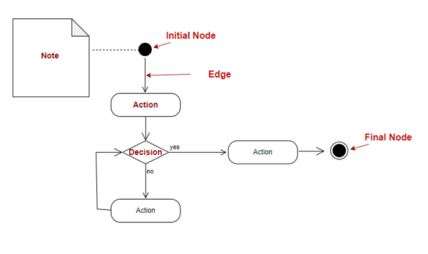
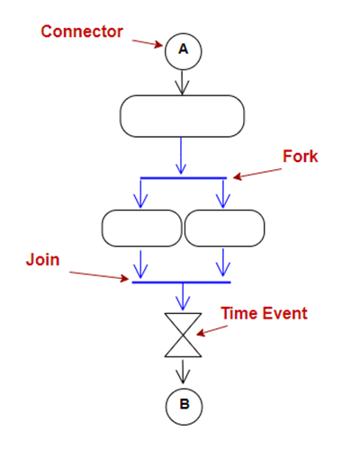
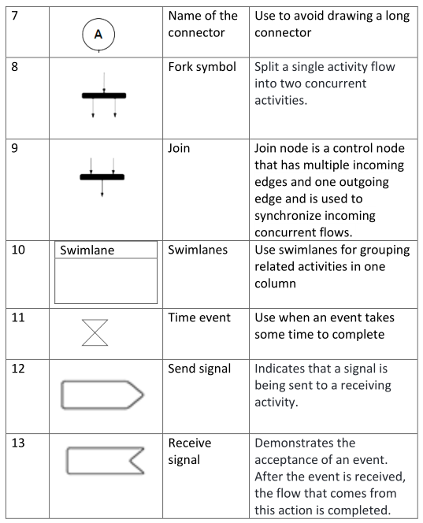
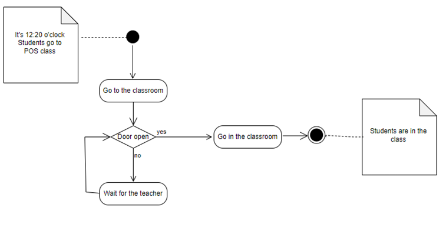
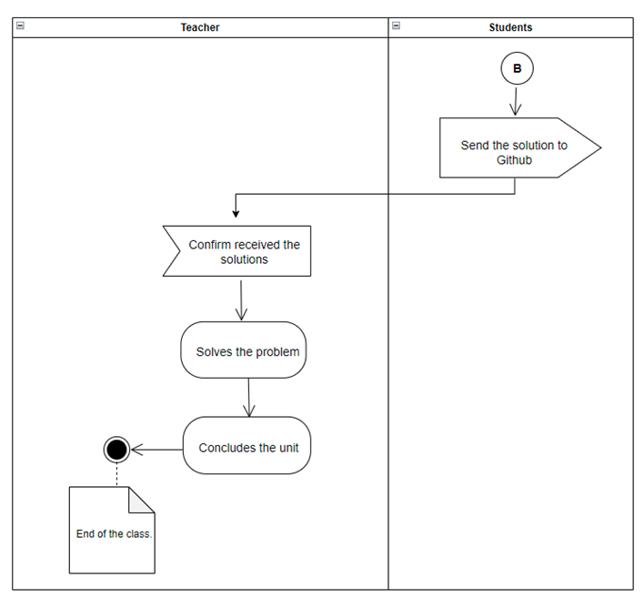

# Unified Modelling Language
1. [What is UML?](#def)
2. [Why UML?](#why)
3. [Activity Diagram](#acti)
- [What is an activity diagram?](#sub1)
- [Benefits of activity diagram](#sub2)
- [Activity diagram symbols](#sub3)
- [Activity diagram example](#sub4)

4. [Class Diagram](#class)
5. [Caution](#caution)
6. [Resources](#resources)
## What is UML? 
- A method of describing the structure or behaviour of a system using diagrams (is also called a *modelling language*)
- Used most often in the field of software engineering
- Aimed at large and complex software applications 

## Why UML? 
- UML assists software maintenance and debugging, as it helps programmers to gain an overview of a system quickly, and to be able to locate where potential bugs lie, even long after the original software developer(s) has moved on from the project.
- It can also make collaboration among team members, or among teams, easier, as it provides a concrete visualisation of which part each team or team member should be in charge of. It also helps to reduce repeated or redundant code.
- UML provides a form of software documentation (in visual form)
- It also offers an explanation of the purposes or objectives of a project to businessmen (who naturally might not understand code!)
- UML can save time and resources in the long run

## Activity Diagram 

### What is an activity diagram? 
The Unified Modeling Language includes several subsets of diagrams, including structure diagrams and behavior diagrams. Activity diagrams, along with use case and state machine diagrams, are considered behavior diagrams because they describe what must happen in the system being modeled.
### Uses of activity diagram 
Consider creating an activity diagram to:
- Demonstrate the logic of an algorithm.
- Describe the steps performed in a UML use case.
- Illustrate a business process or workflow between users and the system.
- Simplify and improve any process by clarifying complicated use cases.
- Model software architecture elements, such as method, function, and operation.
### Activity diagram symbols 

  

### Activity example 

## Class Diagram 
- is suitable for projects that use object-oriented programming approach
- is used to capture the classes (usually just the classes!) used within a software application. 
- is the most widely used UML diagram
- acts as the blueprints for database design (shares many similarities with ERD)

##### Example of a UML class diagram:
****

##### Construct a class in UML class diagram:

![[Pasted image 20221031083928.png]]

A simple rectangle, divided into three compartments:
- Class name (mandatory)
- Attributes (optional - use when a class has attributes and don't when a class doesn't)
- Methods (optional - use when a class has methods and don't when a class doesn't)

##### Associations in UML Class Diagram
Generalisation: used to denote a class is a child class of another.

![[Pasted image 20221031084226.png]]

Association: used to denote a relationship between two classes (often comes with a verb to describe what the relationship is)

![[Pasted image 20221031084639.png]]

## Case Studies
## Caution 
UML however can have some disadvantages:
- It can be time-consuming to build, taking away time from actual coding
- UML diagrams can get out-of-date quickly past the planning phase as code is written, revised and changed
- The sheer number of diagrams and rules on notations can be overwhelming

To make the most out of UML for small projects:
- During planning phase, can "relax on the rules" (i.e. projects do not need to use elaborate set of notations like other professionally produced UML diagrams)
- Use pencil and paper. They do the job more quickly and efficiently than any other diagramming software
- Use tools to generate UML from source code. Try with small source file first to decide if you like the appearance of the chosen tool.
- Draw elaborate diagrams only for DA presentation/ writing purposes.
- For DA, class, activity and sequence (probably use case) are usually enough. You might not need to use all of these, however.

## Resources 
#### 1. Tutorials
- [ACSSE Software Modelling Guide](https://uml.blauw.me/)
covers most frequently used, and perhaps most DA-relevant too, diagrams: use case, activity, class & sequence diagrams

- [javapoint](https://www.javatpoint.com/uml)
covers all UML diagram types. Expands explanation from ACSSE, with examples.

- [UML-diagrams.org](https://www.uml-diagrams.org/class-diagrams-overview.html)
covers all UML diagram types, but most valuable are probably their example diagrams 
while reading these example diagrams, remember: relax on the rules!!
#### 2. Free UML tools
*Remember: during planning phase pencils and paper are your best bet! 
Use the following when you want neat, presentable diagrams for DA defence purposes*
- [Diagrams](https://app.diagrams.net/) (free, no limit)
- [Software Ideas Modeller](https://www.softwareideas.net/en/download) (limit to 2 projects & a total of 400 objects for free plan)
- [Gliffy](https://help.gliffy.com/online/Content/GliffyOnline/free_for_students.htm) (free student account available - follow link to read more - must email sales to activate because BULME doesn't use .edu or .ac domains)

##### Generating UML diagrams from source code:
-   Visual Studio (Class Designer component for C & C++) (available on both Community and Professional)
-   [Umbrello](https://umbrello.kde.org/installation.php) (C, C++, Python, Java & many others)\*
-   [Doxygen](https://www.doxygen.nl/download.html) (C, C++, Python, Java & a few others)\*
-   [IntelliJ Ultimate](https://www.jetbrains.com/community/education/) (Java & Python)\*\*

*\*free, open-source software* 
*\*\*free student account available*

